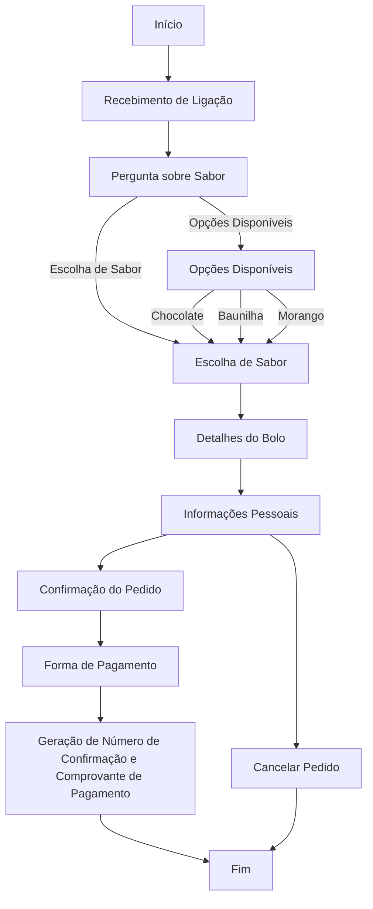

# Atividades do Módulo 4 - QA NA PRÁTICA 📚

Esse [repositório](https://github.com/LeanDevLima/Squad02_M4) é dedicado às atividades realizadas durante o Módulo 4 - M4 - LÓGICA DE PROGRAMAÇÃO COM PYTHON do curso de Quality Assurance oferecido pelo [**Instituto JogaJunto**](https://www.jogajuntoinstituto.org/). 

## 🚀 Descrição da 2ª Atividade: 🌟
 

🔍Em SQUADs. Leiam o case a seguir, que conta como é o processo de pedidos na loja de bolos "DELÍCIAS DE JOGAR JUNTO". Depois, acessem o site  whimsical, onde realizará a atividade. Caso os integrantes do grupo tenham alguma dificuldade para acessar o whimsical, baixem o arquivo PPT "Fluxo de Atendimento", que contém algumas formas geométricas de um fluxograma e realizem a atividade nesse arquivo. Usem formas geométricas (retângulos, losangos, círculos, setas) para representar cada etapa do processo de venda do bolo. Usem setas para mostrar a direção do fluxo, conectando as etapas. Utilizem as formas corretas para representar decisões, início, fim, entre outras partes.

___
Case: 

### O pedido de Maria ###

Maria ligou para encomendar um bolo para o aniversário de sua mãe. A atendente perguntou se ela teria algum sabor de preferência, mas Maria estava em dúvida.

A atendente falou sobre as opções disponíveis no dia - chocolate, baunilha e morango e Maria escolheu o bolo de chocolate, fornecendo detalhes sobre tamanho, data e horário de entrega.

A atendente perguntou algumas informações pessoais para registrar no sistema como, nome, endereço e número de telefone.

Ao final, antes de enviar o link para pagamento, ela confirmou o pedido e o preço e perguntou qual seria a forma de pagamento.

Após confirmar tudo, Maria recebeu em seu whatsapp um número de confirmação de pedido e um arquivo PDF com o comprovante de pagamento. 

___

- Nessa atividade criamos primeiro um rascunho de como ficaria o fluxo:

___

**Início**
-> Representado por um retângulo com a palavra "Início"

**Recebimento de Ligação**
-> Representado por um retângulo com "Recebimento de Ligação"

**Pergunta sobre Sabor**
-> Representado por um retângulo com "Pergunta sobre Sabor"
-> Uma seta conecta "Recebimento de Ligação" a "Pergunta sobre Sabor"

**Opções Disponíveis**
-> Representado por um losango com "Opções Disponíveis"
-> Conectado a "Pergunta sobre Sabor" com uma seta
-> Saída de "Opções Disponíveis" para as opções: "Chocolate", "Baunilha", "Morango"

**Escolha de Sabor**
-> Representado por um retângulo com "Escolha de Sabor"
-> Conectado aos sabores do losango com setas
-> Saída para "Detalhes do Bolo" com uma seta

**Detalhes do Bolo**
-> Representado por um retângulo com "Detalhes do Bolo"
-> Conectado a "Escolha de Sabor" com uma seta

**Informações Pessoais**
-> Representado por um retângulo com "Informações Pessoais"
-> Conectado a "Detalhes do Bolo" com uma seta

**Confirmação do Pedido**
-> Representado por um losango com "Confirmação do Pedido"
-> Conectado a "Informações Pessoais" com uma seta
-> Saída para "Forma de Pagamento" e "Cancelar Pedido"

**Forma de Pagamento**
-> Representado por um retângulo com "Forma de Pagamento"
-> Conectado a "Confirmação do Pedido" com uma seta

**Geração de Número de Confirmação e Comprovante de Pagamento**
-> Representado por um retângulo com "Geração de Número de Confirmação e Comprovante de Pagamento"
-> Conectado a "Forma de Pagamento" com uma seta

**Fim**
-> Representado por um retângulo com a palavra "Fim"
-> Conectado a "Geração de Número de Confirmação e Comprovante de Pagamento" com uma seta

___

- Em seguida, baseando-se no nosso rascunho criamos o fluxograma conforme solicitado o enunciado da atividade:

___

 

Obs: O enunciado desta atividade recomendou o uso da ferramenta Whimsical, que foi seguido conforme instruído. No entanto, para melhorar a visualização neste repositório, optei por apresentar o diagrama usando o estilo de formatação Mermaid.

## Integrantes da Squad:

| Beatriz Souza  | [Bruno Soares](https://www.linkedin.com/in/bruno-soaresdev/)  | [Leanderson Lima](https://www.linkedin.com/in/leanderson-dias-de-lima/) | [Rebeca Borges](https://www.linkedin.com/in/rebecaborgess/) | Sara Cruz | 