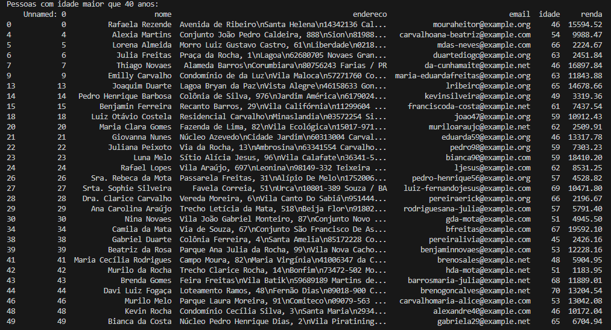
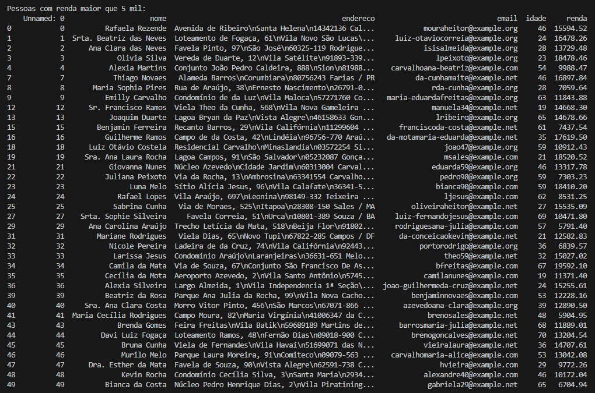

# Atividades do Módulo 4 - QA NA PRÁTICA 📚

Esse [repositório](https://github.com/LeanDevLima/Squad02_M4) é dedicado às atividades realizadas durante o Módulo 4 - M4 - LÓGICA DE PROGRAMAÇÃO COM PYTHON do curso de Quality Assurance oferecido pelo [**Instituto JogaJunto**](https://www.jogajuntoinstituto.org/). 

## 🚀 Descrição da 34ª Atividade: 🌟
<br>


🔍 PARTE 2 Agora, abriremos tabelas já existentes e manipularemos os dados. Baixe a tabela csv abaixo e crie um df.

dados_ficticios.csv
6 KB

Filtre as pessoas levando em consideração os seguintes critérios:

- com idade maior que 40 anos;
- com renda maior de 5 mil;
- com renda maior de 15 mil.

---

Alterei o nome do arquivo dados_ficticios.csv para atividade_dados.csv para facilitar a execução dessa atividade pois uso a mesma tabela de dados na Atividade 28, e inseri o arquivo na pasta 'Atividades' conforme o padrão adotado nesse repositório.


```python

import sys
import os

root_dir = os.path.dirname(os.path.abspath(__file__))  # 
project_dir = os.path.join(root_dir, '..') 
sys.path.append(project_dir)  

import pandas as pd

caminho_arquivo_csv = 'Atividades/atividade_dados.csv'
df = pd.read_csv(caminho_arquivo_csv)

filtro_idade_maior_40 = df['idade'] > 40
pessoas_idade_maior_40 = df[filtro_idade_maior_40]

filtro_renda_maior_5mil = df['renda'] > 5000
pessoas_renda_maior_5mil = df[filtro_renda_maior_5mil]

filtro_renda_maior_15mil = df['renda'] > 15000
pessoas_renda_maior_15mil = df[filtro_renda_maior_15mil]

print("Pessoas com idade maior que 40 anos:")
print(pessoas_idade_maior_40)

print("\nPessoas com renda maior que 5 mil:")
print(pessoas_renda_maior_5mil)

print("\nPessoas com renda maior que 15 mil:")
print(pessoas_renda_maior_15mil)

```
---

Ao rodar esse código temos o seguinte resultado no terminal:






---

O arquivo correspondente a essa atividade está no seguinte local: Atividades\Atividade34.py.

## Integrantes da Squad:

| Beatriz Souza  | [Bruno Soares](https://www.linkedin.com/in/bruno-soaresdev/)  | [Leanderson Lima](https://www.linkedin.com/in/leanderson-dias-de-lima/) | [Rebeca Borges](https://www.linkedin.com/in/rebecaborgess/) | Sara Cruz | 