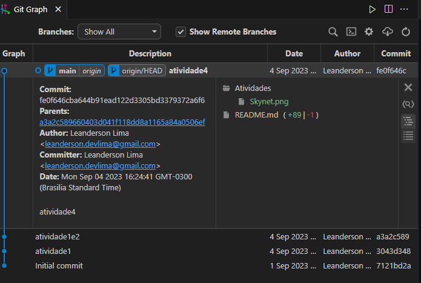

# Atividades do Módulo 4 - QA NA PRÁTICA 📚

Esse [repositório](https://github.com/LeanDevLima/Squad02_M4) é dedicado às atividades realizadas durante o Módulo 4 - M4 - LÓGICA DE PROGRAMAÇÃO COM PYTHON do curso de Quality Assurance oferecido pelo [**Instituto JogaJunto**](https://www.jogajuntoinstituto.org/). 

## 🚀 Descrição da 4ª Atividade: 🌟
 

🔍EM SQUADS. Utilizando seus conhecimentos, crie seu repositório (local e na nuvem) e faça seus primeiros commit e push! Discussão após atividade. 

Como foi a experiência? | Houve alguma dificuldade? | Como os integrantes do SQUAD se relacionaram? | Fariam algo diferente? O que? | Como se sentiram nesse processo?

- Para essa atividade vou considerar esse mesmo [repositório](https://github.com/LeanDevLima/Squad02_M4).

Fiz uso da extensão [Git Graph](https://marketplace.visualstudio.com/items?itemName=mhutchie.git-graph) para demonstrar a execução dessa atividade.

 

No que diz respeito à experiência resultante desta atividade, observamos que alguns membros da turma demonstraram um maior domínio do conceito de Git, enquanto outros estavam menos familiarizados. Trabalhamos em conjunto, auxiliando-nos mutuamente, para garantir que todos pudessem concluir com sucesso a atividade.

## Integrantes da Squad:

| Beatriz Souza  | [Bruno Soares](https://www.linkedin.com/in/bruno-soaresdev/)  | [Leanderson Lima](https://www.linkedin.com/in/leanderson-dias-de-lima/) | [Rebeca Borges](https://www.linkedin.com/in/rebecaborgess/) | Sara Cruz | 