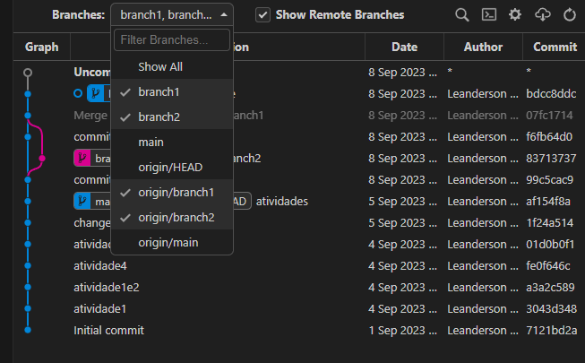
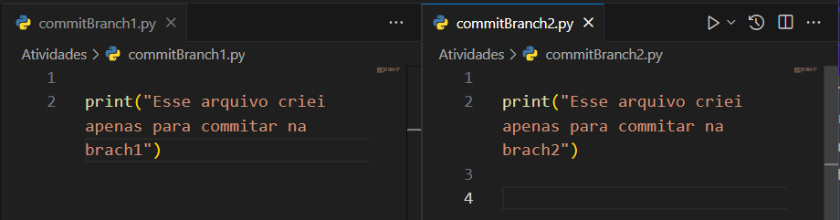
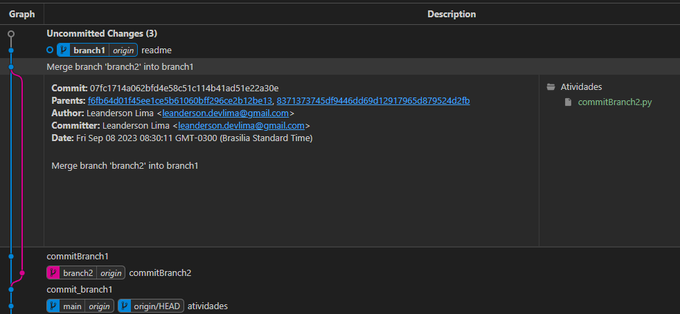
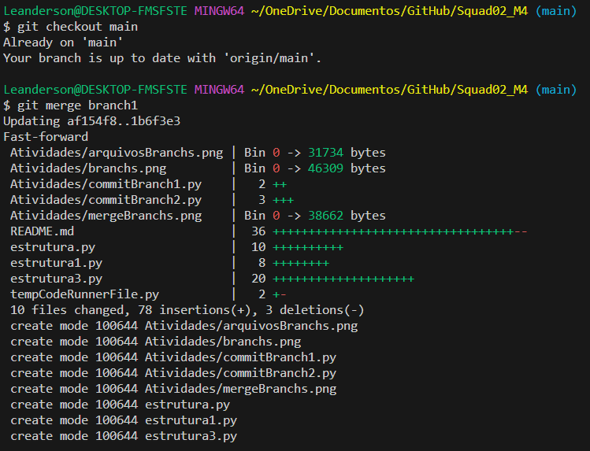
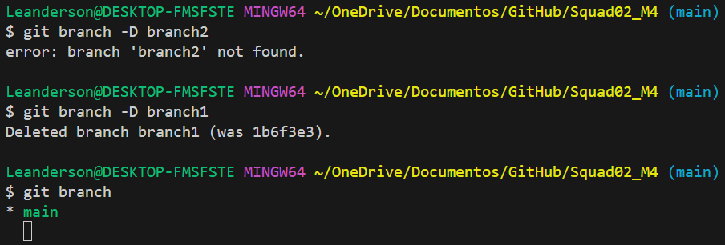
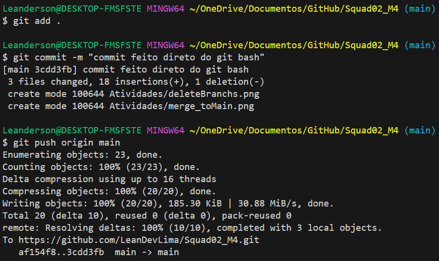
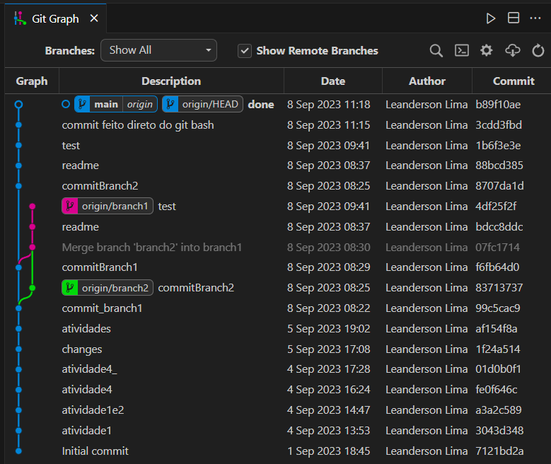

# Atividades do Módulo 4 - QA NA PRÁTICA 📚

Esse [repositório](https://github.com/LeanDevLima/Squad02_M4) é dedicado às atividades realizadas durante o Módulo 4 - M4 - LÓGICA DE PROGRAMAÇÃO COM PYTHON do curso de Quality Assurance oferecido pelo [**Instituto JogaJunto**](https://www.jogajuntoinstituto.org/). 

## 🚀 Descrição da 5ª Atividade: 🌟
 

🔍EM SQUADS Realizem os passos detalhados a seguir: Clone o repositório que você criou. Agora você vai criar uma branch e subir arquivos diferentes em cada uma dela. Mescle as branchs.

- Para essa atividade vou considerar esse mesmo [repositório](https://github.com/LeanDevLima/Squad02_M4). Fiz uso da extensão [Git Graph](https://marketplace.visualstudio.com/items?itemName=mhutchie.git-graph) para demonstrar a execução dessa atividade.

1- Primeiramente criei duas branchs, branch1 e branch2.

2- Em seguida criei um arquivo em cada branch, commitBranch1.py na branch1 e commitBranch2.py na branch2 (ambos estão na pasta 'Atividades' desse repositório).

Por fim fiz um merge dessas branches, transformando as duas na branch1.

--- 
As etapas seguintes, decidi executar os comando direto pelo terminal para agilizar a conclusão da atividade.

---
3- Usando o comando 'git checkout main' retornei para a branch principal, e usei o comando 'git merge branch1' pegar as alterações da branch1 e inserir na main.

4- Como não pretendo usar outras branchs nesse repositório fiz a exclusão das mesmas para trabalhar apenas com a branch original (main). O comando para tal é o 'git branch -d (nome da branch)', e para forçar essa ação o comando é quase o mesmo: git branch -D (nome da branch). 

Eu optei pela segunda opção, dei um git branch -D branch2 só por garantia (vai que né 😅) e depois excluí a branch1 e usei o comando git branch para confirmar se somente a branch principal main estava em uso.

5- E por fim, subi as informações para o Github.

6- Resultado final no Graph:

## Integrantes da Squad:

| Beatriz Souza  | [Bruno Soares](https://www.linkedin.com/in/bruno-soaresdev/)  | [Leanderson Lima](https://www.linkedin.com/in/leanderson-dias-de-lima/) | [Rebeca Borges](https://www.linkedin.com/in/rebecaborgess/) | Sara Cruz | 