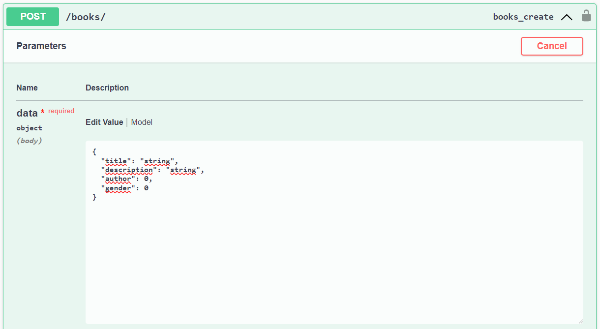

# Atividades do Módulo 4 - QA NA PRÁTICA 📚

Esse [repositório](https://github.com/LeanDevLima/Squad02_M4) é dedicado às atividades realizadas durante o Módulo 4 - M4 - LÓGICA DE PROGRAMAÇÃO COM PYTHON do curso de Quality Assurance oferecido pelo [**Instituto JogaJunto**](https://www.jogajuntoinstituto.org/). 

## 🚀 Descrição da Atividade Final: 🌟
<br>


Sim, ela voltou! Aquela que é a mais temida: atividade de requisição em APIs!!

Baseando-se nos conhecimentos adquiridos previamente sobre API e nas últimas aulas de  Python, façam as seguintes requisições nos endpoints:
http://apilivro.jogajuntoinstituto.org/swagger/


Cadastre 4 livros, com as seguintes informações em um json: 
Título, Autor, Gênero e Edição.

Faça requisições GET em todos os livros e veja se os cadastrados por você estão disponíveis.

### Regras de execução:

Nessa Api existem algumas condições para que um Livro seja criado. É necessário ter o ID de 'author' e 'gender', essa informação pode ser verificado no Swagger dessa API conforme o print abaixo. Significa que temos que criá-los primeiro.



Tomei o cuidado de criar um autor chamado 'Leanderson' e um gênero chamado 'Squad2' para facilitar a visualização do resultado dessa atividade.

Nesse código eu inseri o 'import sys' e o 'import os' e as informações das linhas 4, 5 e 6, para que esse código pudesse ser executado dentro da pasta 'Atividades' conforme o padrão adotado nesse repositório.

Usei a biblioteca Faker para criar dados fictícios para os nomes dos livros e a biblioteca Pandas para criar o DataFrame com os livros cadastrados.

### O código:

```python
import sys
import os

root_dir = os.path.dirname(os.path.abspath(__file__))
project_dir = os.path.join(root_dir, '..')
sys.path.append(project_dir)

import requests
import json
import pandas as pd
from faker import Faker

base_url = 'http://apilivro.jogajuntoinstituto.org/'

def post_request(endpoint, data):
    response = requests.post(base_url + endpoint, json=data)
    if response.status_code == 201:
        print(f"Requisição POST para '{endpoint}' realizada com sucesso!")
        return response.json()
    else:
        print(f"Erro ao fazer a requisição POST para '{endpoint}': {response.status_code}")
        print(response.text)
        return None

faker = Faker()

autor_data = {"name": "Leanderson"}
autor_cadastrado = post_request('authors/', autor_data) 

if autor_cadastrado is None:
    exit()

genero_data = {"name": "Squad2", "squad": "Squad2"}
genero_cadastrado = post_request('genders/', genero_data)  

if genero_cadastrado is None:
    exit()

livros_data = []
for _ in range(4):
    livro_data = {
        "title": faker.catch_phrase(),
        "description": faker.paragraph(),
        "author": autor_cadastrado['id'],
        "gender": genero_cadastrado['id']
    }
    livro_cadastrado = post_request('books/', livro_data) 
    if livro_cadastrado is not None:
        livros_data.append(livro_cadastrado)

if not livros_data:
    print("Não foi possível cadastrar os livros.")
    exit()

response = requests.get(base_url + 'books/')
if response.status_code == 200:
    livros_cadastrados = response.json()
    print("\nLivros cadastrados:")
    for livro in livros_cadastrados:
        print(f"Título: {livro['title']}, Descrição: {livro['description']}, Autor ID: {livro['author']}, Gênero ID: {livro['gender']}")
else:
    print("Erro ao buscar livros cadastrados.")

df = pd.DataFrame(livros_data)
print("\nDataFrame com os livros cadastrados:")
print(df)


```


### Resultado no terminal:

- Primeiro, confomre inseri na função 'post_request' eu tenho o retorno a respeito da criação de __author__ e __gender__.

```bash
Requisição POST para 'authors/' realizada com sucesso!
Requisição POST para 'genders/' realizada com sucesso!
Requisição POST para 'books/' realizada com sucesso!
Requisição POST para 'books/' realizada com sucesso!
Requisição POST para 'books/' realizada com sucesso!
Requisição POST para 'books/' realizada com sucesso!
```

- Em seguida é demonstrado no terminal toda a lista de todos os livros já cadastrados nessa API, esse é o resultado correspondente somente aos 4 livros com nomes fictícios que esse código gerou:

```bash 
Livros cadastrados:

Título: Digitized executive toolset, Descrição: Gun activity leave show. Hot indicate include development site. Truth not thought left mother sometimes., Autor ID: 38, Gênero ID: 24
Título: Monitored demand-driven infrastructure, Descrição: Tree society cup. Week action citizen loss what anyone economic. As test south grow., Autor ID: 38, Gênero ID: 24
Título: Upgradable multi-state encryption, Descrição: Hotel support study similar way. Occur stuff several former national television. Economic window account care bit., Autor ID: 38, Gênero ID: 24
Título: Programmable context-sensitive policy, Descrição: Receive sing here choice class do military. Then information cell close nothing city respond. Let rise single stage., Autor ID: 38, Gênero ID: 24
```

- E, para concluir, aqui está o DataFrame que apresenta os livros registrados:

```bash

DataFrame com os livros cadastrados:
                                    title                                        description  author  gender
0             Digitized executive toolset  Gun activity leave show. Hot indicate include ...      38      24
1  Monitored demand-driven infrastructure  Tree society cup. Week action citizen loss wha...      38      24
2       Upgradable multi-state encryption  Hotel support study similar way. Occur stuff s...      38      24
3   Programmable context-sensitive policy  Receive sing here choice class do military. Th...      38      24

```

### Considerações finais:

Python tem se mostrado uma linguagem de manuseio tranquilo, há bastante informações sobre ele e suas bibliotecas na sua documentação:

- https://www.python.org/

Até esse momento não houve nenhuma informação que eu não encontrei ou precisei usar outra fonte de pesquisa.

Uma dificuldade que tive durante a execução dessa tarefa foi uma falha da URL da API que eu inseri no código para gerar o __author__ e o __gender__, em uma parte da mensagem que erro continha a seguinte informação:

```html
<tr>
    <td>exc</td>
        <td class="code">
            <pre>RuntimeError(&quot;You called this URL via POST, but the URL doesn&#x27;t end in a slash and you have APPEND_SLASH set. Django can&#x27;t redirect to the slash URL while maintaining POST data. Change your form to point to apilivro.jogajuntoinstituto.org/authors/ (note the trailing slash), or set APPEND_SLASH=False in your Django settings.&quot;)</pre>
        </td>
</tr>

```
O erro que eu estava enfrentando é um erro interno do servidor (status code 500) que ocorreu durante a execução de uma requisição POST para a URL http://apilivro.jogajuntoinstituto.org/authors. O erro específico aponta para um problema relacionado ao Django.

Essa mensagem de erro significa que eu estava fazendo uma requisição POST para uma URL que não termina com uma barra /, mas o Django está configurado para adicionar automaticamente uma barra às URLs (devido à configuração APPEND_SLASH).

Um modo de resolver seria desativar o APPEND_SLASH, como eu não tinha o acesso para fazer essa alteração, bastou eu inserir uma barra "/"  no final da URL correspondete a __authors__,  __genders__ e __books__, o que pode ser observado nas linhas 28, 34 e 47 do código.

Só imagine como ficou meu estado de espírito eu perceber que era só por uma "/" depois de mais de 24h de muitas e muitas tentativas de execução dessa atividade. As animações GIF a seguir proporcionam uma representação visual do processo:

#### Início do processo


#### Durante o processo


#### Fim do processo


---

Encerro aqui com um enorme agradecimento por esta atividade incrível e por toda a bagagem de conhecimento que acumulei durante este módulo 4. Foi uma jornada e tanto! 😊🚀

---

O arquivo correspondente a essa atividade está no seguinte local: Atividades\AtividadeFinal.py.

## Integrantes da Squad:

| Beatriz Souza  | [Bruno Soares](https://www.linkedin.com/in/bruno-soaresdev/)  | [Leanderson Lima](https://www.linkedin.com/in/leanderson-dias-de-lima/) | [Rebeca Borges](https://www.linkedin.com/in/rebecaborgess/) | Sara Cruz | 