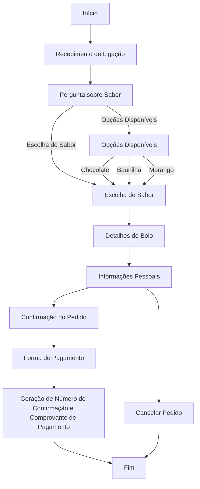

# Atividades do Módulo 4 - QA NA PRÁTICA 📚

Esse [repositório](https://github.com/LeanDevLima/Squad02_M4) é dedicado às atividades realizadas durante o Módulo 4 - M4 - LÓGICA DE PROGRAMAÇÃO COM PYTHON do curso de Quality Assurance oferecido pelo [**Instituto JogaJunto**](https://www.jogajuntoinstituto.org/). 

Clique nas "►" abaixo para visualizar os conteúdos trabalhados nesse módulo. Para recolher o conteúdo, basta clicar nas "▼" novamente. 😁

<details>
<summary> Conceitos fundamentais 🌟</summary>

<details>
<summary>🚀 Descrição da 1ª Atividade: 🌟</summary>
<br>
🔍 A turma será dividida em duplas. Cada dupla será composta por uma pessoa no papel de INSTRUTOR e outra no de EXECUTOR - decidam quem será quem. A seguir, liberaremos dois arquivos, um nomeado como INSTRUTOR(A) e outro como EXECUTOR(A). INSTRUTOR(A) fará o download APENAS do arquivo nomeado como INSTRUTOR(A). EXECUTOR(A) fará o download APENAS do arquivo nomeado como EXECUTOR. Sigam as instruções encontradas nos respectivos arquivos, respeitando os tempos de realização da atividade.

<br>

 - Essa atividade fizemos em Squad.

Essa atividade foi uma experiência emocionante e colaborativa que envolveu comunicação e cooperação para atingir um objetivo final: a criação de uma forma geométrica, que, no nosso caso, acabou sendo um triângulo. O elemento surpresa foi a chave para tornar a atividade divertida e desafiadora.

A turma foi dividida em squads, cada squad tinha dois papéis definidos: um instrutor e um executor. Os instrutores tinham a responsabilidade de fazer o download exclusivamente do arquivo nomeado como INSTRUTOR(A), enquanto os executores faziam o download apenas do arquivo EXECUTOR(A). Essa divisão de tarefas criou uma dinâmica interessante, onde os instrutores tinham que fornecer informações claras e precisas para que os executores pudessem realizar a tarefa corretamente, mas não podiam falar qual seria o desenho final.

A atividade exigiu habilidades de comunicação eficaz, já que os instrutores precisavam explicar as instruções contidas no arquivo INSTRUTOR(A) de maneira concisa e compreensível. Ao mesmo tempo, os executores precisavam estar atentos às instruções e seguir o cronograma estabelecido para a atividade.

À medida que a atividade avançava começamos a perceber que a cooperação era essencial para atingir o objetivo final de forma eficaz e dentro do prazo. O trabalho em equipe se tornou fundamental, com os membros das squads trocando ideias, esclarecendo dúvidas e apoiando-se mutuamente.

No final, quando todas as etapas foram concluídas, revelamos qual era a forma geométrica que estávamos descrevendo, e foi surpreendente perceber como cada uma delas tinha um triângulo em comum, apesar das abordagens e instruções variadas. Isso ressaltou a importância da clareza na comunicação e da cooperação no trabalho em equipe.

Como um dos instrutores, tive a oportunidade de dar as intruções, garantindo que as instruções fossem compreendidas e seguidas. Foi uma experiência gratificante ver como a cooperação e a comunicação eficaz levaram ao sucesso da atividade e à criação do triângulo. No geral, a atividade em squad foi uma combinação perfeita de desafio, diversão e aprendizado sobre a importância da colaboração.

</details>

<details>
<summary>🚀 Descrição da 2ª Atividade: 🌟</summary>
<br>

🔍Em SQUADs. Leiam o case a seguir, que conta como é o processo de pedidos na loja de bolos "DELÍCIAS DE JOGAR JUNTO". Depois, acessem o site  whimsical, onde realizará a atividade. Caso os integrantes do grupo tenham alguma dificuldade para acessar o whimsical, baixem o arquivo PPT "Fluxo de Atendimento", que contém algumas formas geométricas de um fluxograma e realizem a atividade nesse arquivo. Usem formas geométricas (retângulos, losangos, círculos, setas) para representar cada etapa do processo de venda do bolo. Usem setas para mostrar a direção do fluxo, conectando as etapas. Utilizem as formas corretas para representar decisões, início, fim, entre outras partes.

___
Case: 

### O pedido de Maria ###

Maria ligou para encomendar um bolo para o aniversário de sua mãe. A atendente perguntou se ela teria algum sabor de preferência, mas Maria estava em dúvida.

A atendente falou sobre as opções disponíveis no dia - chocolate, baunilha e morango e Maria escolheu o bolo de chocolate, fornecendo detalhes sobre tamanho, data e horário de entrega.

A atendente perguntou algumas informações pessoais para registrar no sistema como, nome, endereço e número de telefone.

Ao final, antes de enviar o link para pagamento, ela confirmou o pedido e o preço e perguntou qual seria a forma de pagamento.

Após confirmar tudo, Maria recebeu em seu whatsapp um número de confirmação de pedido e um arquivo PDF com o comprovante de pagamento. 


___

- Nessa atividade criamos primeiro um rascunho de como ficaria o fluxo:

___

**Início**
-> Representado por um retângulo com a palavra "Início"

**Recebimento de Ligação**
-> Representado por um retângulo com "Recebimento de Ligação"

**Pergunta sobre Sabor**
-> Representado por um retângulo com "Pergunta sobre Sabor"
-> Uma seta conecta "Recebimento de Ligação" a "Pergunta sobre Sabor"

**Opções Disponíveis**
-> Representado por um losango com "Opções Disponíveis"
-> Conectado a "Pergunta sobre Sabor" com uma seta
-> Saída de "Opções Disponíveis" para as opções: "Chocolate", "Baunilha", "Morango"

**Escolha de Sabor**
-> Representado por um retângulo com "Escolha de Sabor"
-> Conectado aos sabores do losango com setas
-> Saída para "Detalhes do Bolo" com uma seta

**Detalhes do Bolo**
-> Representado por um retângulo com "Detalhes do Bolo"
-> Conectado a "Escolha de Sabor" com uma seta

**Informações Pessoais**
-> Representado por um retângulo com "Informações Pessoais"
-> Conectado a "Detalhes do Bolo" com uma seta

**Confirmação do Pedido**
-> Representado por um losango com "Confirmação do Pedido"
-> Conectado a "Informações Pessoais" com uma seta
-> Saída para "Forma de Pagamento" e "Cancelar Pedido"

**Forma de Pagamento**
-> Representado por um retângulo com "Forma de Pagamento"
-> Conectado a "Confirmação do Pedido" com uma seta

**Geração de Número de Confirmação e Comprovante de Pagamento**
-> Representado por um retângulo com "Geração de Número de Confirmação e Comprovante de Pagamento"
-> Conectado a "Forma de Pagamento" com uma seta

**Fim**
-> Representado por um retângulo com a palavra "Fim"
-> Conectado a "Geração de Número de Confirmação e Comprovante de Pagamento" com uma seta

___

- Em seguida, baseando-se no nosso rascunho criamos o fluxograma conforme solicitado o enunciado da atividade:

___



Obs: O enunciado desta atividade recomendou o uso da ferramenta Whimsical, que foi seguido conforme instruído. No entanto, para melhorar a visualização neste repositório, optei por apresentar o diagrama usando o estilo de formatação Mermaid.

</details>
</details>

<details>
<summary>Preparando o ambiente🌟</summary>
<br>

<details>
<summary>🚀 Descrição da 3ª Atividade: 🌟</summary>
<br>

🔍EM SQUADs. Escrevam um PROMPT no chatGPT, em busca da definição dos três conceitos abaixo, relacionados com o uso do Git: 

 TRACKING - COMMIT - BRANCHES - MERGE

Em seguida, discutam sobre os temas e escolham um integrante do SQUAD que, caso sorteado, deverá explicar para a turma o conceito, dando um exemplo.

- Essa atividade foi feita durante a aula, abaixo segue o que foi realizado em grupo e discutido com toda a turma com algumas considerações minhas:

No Chat GPT inseri as seguintes informações:

    Por favor, forneça definições claras e detalhadas dos seguintes conceitos relacionados ao uso do Git:

    TRACKING - Descreva o que significa 'tracking' em relação ao Git e como ele é usado para monitorar alterações em repositórios.

    COMMIT - Explique o conceito de 'commit' no Git, incluindo sua finalidade e como ele é utilizado para registrar alterações no histórico de um projeto.

    BRANCHES - Defina o termo 'branches' no contexto do Git, destacando sua importância na organização do desenvolvimento de software.

    MERGE - Descreva o que significa 'merge' em Git, como é realizado e em que situações é útil para combinar diferentes linhas de desenvolvimento.

    Desde já agradeço pelas definições para melhor compreensão destes conceitos relacionados ao Git.

---
Pedi 'por favor' e agradeci no final porque se um dia essa ferramenta virar algo parecido com a [SkyNet](https://pt.wikipedia.org/wiki/Skynet) vão perceber que eu era um ser humano legal e pode ser que minha vida seja poupada. 🫠 

[](https://medium.com/data-driven-fiction/the-skynet-moment-looms-with-chatgpt-5ec9714f2750)

---

Esse foi o resultado apresentado:


Claro, aqui estão as definições detalhadas dos conceitos relacionados ao Git:

1. **TRACKING**:

   No contexto do Git, "tracking" refere-se à capacidade de um repositório local de acompanhar as alterações feitas em um repositório remoto. Quando você clona um repositório remoto para o seu ambiente local, o Git estabelece uma relação de rastreamento entre o seu repositório local e o repositório remoto. Isso permite que você saiba se as alterações foram feitas no repositório remoto desde a última vez que você sincronizou.

   O rastreamento é útil para manter seu repositório local atualizado e garantir que você esteja trabalhando com a versão mais recente do código. Para atualizar seu repositório local com as alterações do repositório remoto, você pode usar comandos como `git pull`.

2. **COMMIT**:

   No Git, um "commit" é uma operação que registra uma alteração específica no histórico de um projeto. Cada commit é uma captura instantânea do estado do projeto em um determinado momento. Os commits são usados para rastrear o progresso do desenvolvimento, facilitar a colaboração e permitir a reversão a versões anteriores do código.

   Cada commit inclui uma mensagem que descreve as alterações feitas. Essas mensagens são cruciais para entender o propósito de cada commit. Os commits também têm identificadores únicos chamados de "hashes" que os tornam identificáveis e recuperáveis.

3. **BRANCHES**:

   Em Git, "branches" (ramos) são caminhos de desenvolvimento separados que permitem que você trabalhe em recursos ou correções de bugs independentemente do ramo principal do projeto (normalmente chamado de "branch master" ou "branch principal"). Cada branch representa uma linha de desenvolvimento isolada, onde você pode adicionar, modificar e excluir arquivos sem afetar outros ramos.

   Branches são úteis para organizar o desenvolvimento, permitindo que várias equipes ou desenvolvedores individuais trabalhem em paralelo sem interferir no trabalho uns dos outros. Quando o desenvolvimento em um branch é concluído, você pode fundir (merge) as alterações de volta ao branch principal.

4. **MERGE**:

   "Merge" em Git se refere ao processo de combinar as alterações de um branch em outro. Isso é comumente usado para incorporar as alterações feitas em um branch de desenvolvimento de recurso ou correção de bug de volta ao branch principal (como o master).

   O merge é útil quando você deseja unir diferentes linhas de desenvolvimento e consolidar as alterações. O Git usa algoritmos para combinar automaticamente as alterações, mas podem ocorrer conflitos se duas alterações conflitantes forem feitas na mesma parte de um arquivo. Nesses casos, você precisa resolver os conflitos manualmente.


</details>

<details>
<summary>🚀 Descrição da 4ª Atividade: 🌟</summary>
<br>

🔍EM SQUADS. Utilizando seus conhecimentos, crie seu repositório (local e na nuvem) e faça seus primeiros commit e push! Discussão após atividade. 

Como foi a experiência? | Houve alguma dificuldade? | Como os integrantes do SQUAD se relacionaram? | Fariam algo diferente? O que? | Como se sentiram nesse processo?

- Para essa atividade vou considerar esse mesmo [repositório](https://github.com/LeanDevLima/Squad02_M4).

Fiz uso da extensão [Git Graph](https://marketplace.visualstudio.com/items?itemName=mhutchie.git-graph) para demonstrar a execução dessa atividade.


<br>

No que diz respeito à experiência resultante desta atividade, observamos que alguns membros da turma demonstraram um maior domínio do conceito de Git, enquanto outros estavam menos familiarizados. Trabalhamos em conjunto, auxiliando-nos mutuamente, para garantir que todos pudessem concluir com sucesso a atividade.


</details>

<details>
<summary>🚀 Descrição da 5ª Atividade: 🌟</summary>
<br>

🔍EM SQUADS Realizem os passos detalhados a seguir: Clone o repositório que você criou. Agora você vai criar uma branch e subir arquivos diferentes em cada uma dela. Mescle as branchs.

- Para essa atividade vou considerar esse mesmo [repositório](https://github.com/LeanDevLima/Squad02_M4). Fiz uso da extensão [Git Graph](https://marketplace.visualstudio.com/items?itemName=mhutchie.git-graph) para demonstrar a execução dessa atividade.

1- Primeiramente criei duas branchs, branch1 e branch2.


2- Em seguida criei um arquivo em cada branch, commitBranch1.py na branch1 e commitBranch2.py na branch2 (ambos estão na pasta 'Atividades' desse repositório).


Por fim fiz um merge dessas branches, transformando as duas na branch1.


--- 
As etapas seguintes, decidi executar os comando direto pelo terminal para agilizar a conclusão da atividade.

---
3- Usando o comando 'git checkout main' retornei para a branch principal, e usei o comando 'git merge branch1' pegar as alterações da branch1 e inserir na main.


4- Como não pretendo usar outras branchs nesse repositório fiz a exclusão das mesmas para trabalhar apenas com a branch original (main). O comando para tal é o 'git branch -d (nome da branch)', e para forçar essa ação o comando é quase o mesmo: git branch -D (nome da branch). 

Eu optei pela segunda opção, dei um git branch -D branch2 só por garantia (vai que né 😅) e depois excluí a branch1 e usei o comando git branch para confirmar se somente a branch principal main estava em uso.


5- E por fim, subi as informações para o Github.


6- Resultado final no Graph:


<br>


Quando se trata da experiência obtida com esta atividade, vimos um resultado semelhante ao da atividade anterior. Notamos que alguns colegas da turma demonstraram um nível mais elevado de conhecimento sobre o conceito do Git, enquanto outros estavam menos familiarizados com ele. Trabalhamos em equipe, apoiando uns aos outros, a fim de assegurar que todos pudessem concluir a atividade com êxito.

</details>

</details>

<details>
<summary>Variáveis e funções básicas 🌟</summary>
<br>


<details>
<summary>🚀 Descrição da 6ª Atividade: 🌟</summary>
<br>

🔍Individualmente: No primeiro bloco, imprima o título "DESAFIO DO CAÍQUE" na tela e, no segundo bloco, realize uma soma simples dos números 145 e 234.


```python
# Primeiro bloco
print("DESAFIO DO CAÍQUE")

# Segundo bloco
resultado = 145 + 234
print("A soma de 145 e 234 é:", resultado)

```

O arquivo dessa atividade está nesse repositório dentro da pasta Atividades: Atividades\Atividade6.py.


</details>


<details>
<summary>🚀 Descrição da 7ª Atividade: 🌟</summary>
<br>

🔍Leiam o caso abaixo e executem usando Python. 
A loja "ROUPAS SA" tem 2000 clientes e quer enviar mensagens nominais a cada um. A mensagem seria a seguinte:

"Olá, PAULA MARTINS. Em JANEIRO você realizou uma compra no valor de R$500,00 e ganhou um desconto de 10% em sua próxima compra. Use o cupom PAULAÉ10."


```python

clientes = [
    {"nome": "Paula Martins", "mes_compra": "Janeiro", "valor_compra": 500.00},
    {"nome": "Lean Lima", "mes_compra": "Setembro", "valor_compra": 1000.00},
    {"nome": "Caique DesafioJJ", "mes_compra": "Dezembro", "valor_compra": 2000.00}
    # É possível adicionar mais clientes nessa parte, basta seguir a mesma formatação do exemplo acima.
]

for cliente in clientes:
    nome_completo = cliente["nome"]
    partes_nome = nome_completo.split()  
    primeiro_nome = partes_nome[0]  
    mes_compra = cliente["mes_compra"]
    valor_compra = cliente["valor_compra"]
    desconto = valor_compra * 0.10

    mensagem = f"Olá, {primeiro_nome}. Em {mes_compra} você realizou uma compra no valor de R${valor_compra:.2f} e ganhou um desconto de 10% em sua próxima compra. Use o cupom {primeiro_nome.upper()}É10."

    print(mensagem)


```

O arquivo dessa atividade está nesse repositório dentro da pasta Atividades: Atividades\Atividade7.py.

</details>

<details>
<summary>🚀 Descrição da 8ª Atividade: 🌟</summary>
<br>

🔍EM SQUAD Objetivo da atividade: Praticar os conceitos vistos até aqui. Como: Faça um programa que capture o nome do usuário, altura em metros, idade e imprima esses dados na tela. 

```python

nome = input("Digite seu nome: ")
altura = int(input("Digite sua altura em centímetros: "))
idade = int(input("Digite sua idade: "))

print("Nome:", nome)
print("Altura:", altura, "centímetros")
print("Idade:", idade, "anos")

```

O arquivo dessa atividade está nesse repositório dentro da pasta Atividades: Atividades\Atividade8.py.

</details>

<details>
<summary>🚀 Descrição da 9ª Atividade: 🌟</summary>
<br>

🔍CONTINUE EM CASA. Agora, implemente uma nova Feature: a funcionalidade de notas. Para isso, insira duas variáveis com espaço para o input e uma terceira com o valor somado da operação. Lembre-se que o tipo de dado retornado da função input, é sempre uma string.
Ao encerrar, faça o push para seu repositório do github e compartilhe o link com a pessoa facilitadora.

```python

nota1 = float(input("Digite a primeira nota: "))
nota2 = float(input("Digite a segunda nota: "))

print("A soma das notas é:", nota1 + nota2)
print("A média das notas é:", (nota1 + nota2)/2)

# Acrescentei a média pois quando fiz somente a soma fiquei com a impressão que estava faltando alguma coisa 😅

```

O arquivo dessa atividade está nesse repositório dentro da pasta Atividades: Atividades\Atividade9.py.

</details>

</details>

<details>
<summary>Operadores Aritméticos 🌟</summary>
<br>

<details>
<summary>🚀 Descrição da 10ª Atividade: 🌟</summary>
<br>

🔍 Em SQUADs Mini Case 1: Idade do Pet e Lucro do PETSHOP A dona de um PETSHOP quer criar um programa para calcular a idade dos cachorros de seus clientes em "anos de cachorro". Como os pets envelhecem de maneira diferente dos humanos - cada ano humano corresponde a 7 do Cachorro. Desafio: Crie um programa Python que calcule a idade de cachorro com base na idade humana. O que seu programa deve conter: 

- Solicitar ao usuário a idade humana do pet (um número inteiro);
- Calcular a idade do pet, levando em consideração que cada ano da idade humana corresponde a 7;
- Exibir a idade do pet ao usuário;
- Além disso, ela deseja calcular, a cada 12 meses, o lucro obtido por banho e por cachorro. 

VALORES POR BANHO X CUSTO POR BANHO

- Cachorro de grande porte: BANHO: R$75,00 | CUSTO: R$20,00
- Cachorro de médio porte: BANHO: R$60,00 | CUSTO: 15,00
- Cachorro de médio porte: BANHO: R$50,00 | CUSTO: R$5,00
- Exemplo: Se um animal de grande porte tomar 10 banhos em 12 meses, no final, o programa deve imprimir a seguinte informação:

      Olá, Tuco tem 35 anos e nos últimos 12 meses o lucro com  este animal foi de R$550,00

```python

def calcular_idade_cachorro():
    idade_humana = int(input("Digite a idade humana do seu pet: "))
    idade_cachorro = idade_humana * 7
    return idade_cachorro

def calcular_lucro_banho(porte, num_banhos):
    precos = {
        "grande": {"banho": 75.00, "custo": 20.00},
        "medio": {"banho": 60.00, "custo": 15.00},
        "pequeno": {"banho": 50.00, "custo": 5.00}
    }

    banho = precos[porte]["banho"]
    custo = precos[porte]["custo"]
    lucro = (banho - custo) * num_banhos
    return lucro

idade_cachorro = calcular_idade_cachorro()
print(f"Seu pet tem {idade_cachorro} anos.")

num_banhos = int(input("Quantos banhos seu pet tomou nos últimos 12 meses? "))
porte_pet = input("Qual é o porte do seu pet (grande, medio, pequeno)? ").lower()

lucro_total = calcular_lucro_banho(porte_pet, num_banhos)

print(f"Nos últimos 12 meses, o lucro com o pet foi de R${lucro_total:.2f}.")

```
O arquivo dessa atividade está nesse repositório dentro da pasta Atividades: Atividades\Atividade10.py.

</details>

<details>
<summary>🚀 Descrição da 11ª Atividade: 🌟</summary>
<br>

🔍 Mini Case 2: Notas dos alunos. Desafio: Fazer um programa que some 4 notas e, no final, tenha a média aritmética dessas notas. O que seu programa deve conter: 
- Um input onde cada interação tenha um texto.
- No final, seu programa deverá ter o output:
  
      “Olá, Caique! Sua média é: 10 pontos”

```python
nota1 = float(input("Digite a primeira nota: "))
nota2 = float(input("Digite a segunda nota: "))
nota3 = float(input("Digite a terceira nota: "))
nota4 = float(input("Digite a quarta nota: "))


media = (nota1 + nota2 + nota3 + nota4) / 4


nome = input("Digite seu nome: ")

print(f"Olá, {nome}! Sua média é: {media} pontos")

```

O arquivo dessa atividade está nesse repositório dentro da pasta Atividades: Atividades\Atividade11.py.

</details>


<details>
<summary>🚀 Descrição da 12ª Atividade: 🌟</summary>
<br>

🔍Mini Case 2: Notas dos alunos. Desafio: Fazer um programa que some 4 notas e, no final, tenha a média aritmética dessas notas. O que seu programa deve conter:

- Um input onde cada interação tenha um texto.
- No final, seu programa deverá ter o output:
  
        “Olá, Caique! Sua média é: 10 pontos”

```python
import math

valor = float(input("Digite um valor: "))

dobro = valor * 2
triplo = valor * 3
quadrado = valor ** 2
raiz_quadrada = math.sqrt(valor)
raiz_cubica = valor ** (1/3)

print(f"Primeiro output: O dobro do valor inserido é {dobro}")
print(f"Segundo output: O triplo do valor inserido é {triplo}")
print(f"Terceiro output: O valor inserido ao quadrado é {quadrado}")
print(f"Quarto output: A raiz quadrada do valor inserido é {raiz_quadrada}")
print(f"Quinto output: A raiz cúbica do valor inserido é {raiz_cubica}")
```

O arquivo dessa atividade está nesse repositório dentro da pasta Atividades: Atividades\Atividade12.py.


</details>

<details>
<summary>🚀 Descrição da 13ª Atividade: 🌟</summary>
<br>

🔍 Mini Case 3: Operações de teste. Imagine que você está em um processo se seleção para ocupar uma vaga de QA e, para testarem seus conhecimentos sobre OPERADORES, propõem o seguinte:

Desafio: Faça um código que permita, ao inserir um valor, o retorno de 5 outputs, sendo eles:

- primeiro output: deve apresentar como resultado o dobro do valor inserido;
- segundo output: deve apresentar como resultado o triplo do valor inserido;
- terceiro output: deve apresentar como resultado o valor inserido ao quadrado;
- quarto output: deve apresentar como resultado a raiz quadrada do valor inserido;
- quinto output: deve apresentar como resultado a raíz cúbica do valor inserido.


```python

import math

valor = float(input("Digite um valor: "))

dobro = valor * 2
triplo = valor * 3
quadrado = valor ** 2
raiz_quadrada = math.sqrt(valor)
raiz_cubica = valor ** (1/3)

print("Dobro do valor: ", dobro)
print("Triplo do valor: ", triplo)
print("Valor ao quadrado: ", quadrado)
print("Raiz quadrada do valor: ", raiz_quadrada)
print("Raiz cúbica do valor: ", raiz_cubica)

```
O arquivo dessa atividade está nesse repositório dentro da pasta Atividades: Atividades\Atividade13.py.


</details>

<details>
<summary>🚀 Descrição da 14ª Atividade: 🌟</summary>
<br>

🔍Em SQUADs Pesquisem os conceitos a seguir 
COLLECTIONS | LISTAS | TUPLAS | DICIONÁRIOS | SETS | INDEX
MONTEM UM SLIDE EXPLICANDO ESSES CONCEITOS, COM EXEMPLOS.

- O professor pediu para que não pesquisássemos COLLECTIONS para que ele mesmo tratasse sobre esse assunto na aula, esse item da pesquiza foi trocado por ARRAY.

**Array:**

- Um array é uma estrutura de dados que armazena um conjunto de elementos do mesmo tipo de dados, sendo organizados em uma sequência contígua na memória.
- Em Python, o termo "array" geralmente se refere a arrays do módulo `array`, que são mais eficientes em termos de espaço do que listas comuns.

   Exemplo de uso de array em Python (com o módulo `array`):

   ```python
   from array import array
   meu_array = array('i', [1, 2, 3, 4, 5])  # 'i' indica que os elementos são inteiros
    ```

**Listas:**

- Listas são coleções ordenadas de elementos que podem ser de diferentes tipos de dados.
- Os elementos em uma lista são indexados por números inteiros e podem ser modificados.

   Exemplo de lista em Python:

   ```python
   minha_lista = [1, 2, 3, "quatro"]
    ```

**Tuplas:**

- Tuplas são semelhantes às listas, mas são imutáveis, ou seja, seus elementos não podem ser alterados após a criação.
- São usadas quando você deseja armazenar um conjunto de valores que não deve ser modificado.

   Exemplo de tupla em Python:

   ```python
   minha_tupla = (1, 2, 3, "quatro")
    ```


**Dicionários:**

- Dicionários são coleções que armazenam pares de chave-valor, onde cada chave é única.
- Os elementos são acessados através de suas chaves, não por índices.

   Exemplo de dicionário em Python:

   ```python
   meu_dicionario = {"nome": "Alice", "idade": 30, "cidade": "Exemplo"}
    ```

**Sets:**

- Sets são coleções não ordenadas de elementos únicos.
- São úteis para armazenar valores distintos e executar operações de conjuntos, como união e interseção.

   Exemplo de set em Python:

   ```python
   meu_set = {1, 2, 3, 4, 4, 5}
    ```

**Index (Índice):**

- O índice refere-se à posição de um elemento em uma coleção, como uma lista ou uma tupla.
- Em Python, os índices começam em 0 para o primeiro elemento, 1 para o segundo, e assim por diante.

   Exemplo de acesso a elementos por índice em Python:

   ```python
   minha_lista = [10, 20, 30, 40]
   primeiro_elemento = minha_lista[0]  # Retorna 10
   terceiro_elemento = minha_lista[2]  # Retorna 30
    ```

</details>


<details>
<summary>🚀 Descrição da 15ª Atividade: 🌟</summary>
<br>

🔍EM SQUAD. Crie um script com as seguintes instruções, pesquisando na internet como fazer: 

- Crie uma tupla com 5 dados;
- Altere a tupla para uma lista;
- Insira 2 dados extras a essa lista;
- Remova o primeiro dado da lista;
- Remova o último dado da lista;
- Faça um print com o primeiro dado da lista;
- Faça um print com a quantidade de dados da lista;
- Crie um dicionário com os seguintes dados:
        Nome, Idade, Profissão
- Imprima somente o valor contido na chave Nome do dicionário.


```python
tupla = (1, 2, 3, 4, 5, 6)
lista = list(tupla)
lista.append(7)
lista.append(8)

del lista[0]
lista.pop()

print("Primeiro dado da lista:", lista[0])
print("Quantidade de dados na lista:", len(lista))

dicionario = {
    "Nome": "Lean",
    "Idade": 25,
    "Profissão": "Desenvolvedor"
}

print("Nome no dicionário:", dicionario["Nome"])

```

O arquivo dessa atividade está nesse repositório dentro da pasta Atividades: Atividades\Atividade15.py.


</details>


</details>

## Integrantes da Squad:

| Beatriz Souza  | [Bruno Soares](https://www.linkedin.com/in/bruno-soaresdev/)  | [Leanderson Lima](https://www.linkedin.com/in/leanderson-dias-de-lima/) | [Rebeca Borges](https://www.linkedin.com/in/rebecaborgess/) | Sara Cruz | 