# Atividades do Módulo 4 - QA NA PRÁTICA 📚

Esse [repositório](https://github.com/LeanDevLima/Squad02_M4) é dedicado às atividades realizadas durante o Módulo 4 - M4 - LÓGICA DE PROGRAMAÇÃO COM PYTHON do curso de Quality Assurance oferecido pelo [**Instituto JogaJunto**](https://www.jogajuntoinstituto.org/). 

Clique nas "►" abaixo para visualizar os conteúdos trabalhados nesse módulo. Para recolher o conteúdo, basta clicar nas "▼" novamente. 😁

🫨 Algorit o que? 🌟

🚀 Descrição da 1ª Atividade: 🌟

 
🔍 A turma será dividida em duplas. Cada dupla será composta por uma pessoa no papel de INSTRUTOR e outra no de EXECUTOR - decidam quem será quem. A seguir, liberaremos dois arquivos, um nomeado como INSTRUTOR(A) e outro como EXECUTOR(A). INSTRUTOR(A) fará o download APENAS do arquivo nomeado como INSTRUTOR(A). EXECUTOR(A) fará o download APENAS do arquivo nomeado como EXECUTOR. Sigam as instruções encontradas nos respectivos arquivos, respeitando os tempos de realização da atividade.

 

 - Essa atividade fizemos em Squad.

Essa atividade foi uma experiência emocionante e colaborativa que envolveu comunicação e cooperação para atingir um objetivo final: a criação de uma forma geométrica, que, no nosso caso, acabou sendo um triângulo. O elemento surpresa foi a chave para tornar a atividade divertida e desafiadora.

A turma foi dividida em squads, cada squad tinha dois papéis definidos: um instrutor e um executor. Os instrutores tinham a responsabilidade de fazer o download exclusivamente do arquivo nomeado como INSTRUTOR(A), enquanto os executores faziam o download apenas do arquivo EXECUTOR(A). Essa divisão de tarefas criou uma dinâmica interessante, onde os instrutores tinham que fornecer informações claras e precisas para que os executores pudessem realizar a tarefa corretamente, mas não podiam falar qual seria o desenho final.

A atividade exigiu habilidades de comunicação eficaz, já que os instrutores precisavam explicar as instruções contidas no arquivo INSTRUTOR(A) de maneira concisa e compreensível. Ao mesmo tempo, os executores precisavam estar atentos às instruções e seguir o cronograma estabelecido para a atividade.

À medida que a atividade avançava começamos a perceber que a cooperação era essencial para atingir o objetivo final de forma eficaz e dentro do prazo. O trabalho em equipe se tornou fundamental, com os membros das squads trocando ideias, esclarecendo dúvidas e apoiando-se mutuamente.

No final, quando todas as etapas foram concluídas, revelamos qual era a forma geométrica que estávamos descrevendo, e foi surpreendente perceber como cada uma delas tinha um triângulo em comum, apesar das abordagens e instruções variadas. Isso ressaltou a importância da clareza na comunicação e da cooperação no trabalho em equipe.

Como um dos instrutores, tive a oportunidade de dar as intruções, garantindo que as instruções fossem compreendidas e seguidas. Foi uma experiência gratificante ver como a cooperação e a comunicação eficaz levaram ao sucesso da atividade e à criação do triângulo. No geral, a atividade em squad foi uma combinação perfeita de desafio, diversão e aprendizado sobre a importância da colaboração.

🚀 Descrição da 2ª Atividade: 🌟

 

🔍Em SQUADs. Leiam o case a seguir, que conta como é o processo de pedidos na loja de bolos "DELÍCIAS DE JOGAR JUNTO". Depois, acessem o site  whimsical, onde realizará a atividade. Caso os integrantes do grupo tenham alguma dificuldade para acessar o whimsical, baixem o arquivo PPT "Fluxo de Atendimento", que contém algumas formas geométricas de um fluxograma e realizem a atividade nesse arquivo. Usem formas geométricas (retângulos, losangos, círculos, setas) para representar cada etapa do processo de venda do bolo. Usem setas para mostrar a direção do fluxo, conectando as etapas. Utilizem as formas corretas para representar decisões, início, fim, entre outras partes.

___
Case: 

### O pedido de Maria ###

Maria ligou para encomendar um bolo para o aniversário de sua mãe. A atendente perguntou se ela teria algum sabor de preferência, mas Maria estava em dúvida.

A atendente falou sobre as opções disponíveis no dia - chocolate, baunilha e morango e Maria escolheu o bolo de chocolate, fornecendo detalhes sobre tamanho, data e horário de entrega.

A atendente perguntou algumas informações pessoais para registrar no sistema como, nome, endereço e número de telefone.

Ao final, antes de enviar o link para pagamento, ela confirmou o pedido e o preço e perguntou qual seria a forma de pagamento.

Após confirmar tudo, Maria recebeu em seu whatsapp um número de confirmação de pedido e um arquivo PDF com o comprovante de pagamento. 

___

- Nessa atividade criamos primeiro um rascunho de como ficaria o fluxo:

___

**Início**
-> Representado por um retângulo com a palavra "Início"

**Recebimento de Ligação**
-> Representado por um retângulo com "Recebimento de Ligação"

**Pergunta sobre Sabor**
-> Representado por um retângulo com "Pergunta sobre Sabor"
-> Uma seta conecta "Recebimento de Ligação" a "Pergunta sobre Sabor"

**Opções Disponíveis**
-> Representado por um losango com "Opções Disponíveis"
-> Conectado a "Pergunta sobre Sabor" com uma seta
-> Saída de "Opções Disponíveis" para as opções: "Chocolate", "Baunilha", "Morango"

**Escolha de Sabor**
-> Representado por um retângulo com "Escolha de Sabor"
-> Conectado aos sabores do losango com setas
-> Saída para "Detalhes do Bolo" com uma seta

**Detalhes do Bolo**
-> Representado por um retângulo com "Detalhes do Bolo"
-> Conectado a "Escolha de Sabor" com uma seta

**Informações Pessoais**
-> Representado por um retângulo com "Informações Pessoais"
-> Conectado a "Detalhes do Bolo" com uma seta

**Confirmação do Pedido**
-> Representado por um losango com "Confirmação do Pedido"
-> Conectado a "Informações Pessoais" com uma seta
-> Saída para "Forma de Pagamento" e "Cancelar Pedido"

**Forma de Pagamento**
-> Representado por um retângulo com "Forma de Pagamento"
-> Conectado a "Confirmação do Pedido" com uma seta

**Geração de Número de Confirmação e Comprovante de Pagamento**
-> Representado por um retângulo com "Geração de Número de Confirmação e Comprovante de Pagamento"
-> Conectado a "Forma de Pagamento" com uma seta

**Fim**
-> Representado por um retângulo com a palavra "Fim"
-> Conectado a "Geração de Número de Confirmação e Comprovante de Pagamento" com uma seta

___

- Em seguida, baseando-se no nosso rascunho criamos o fluxograma conforme solicitado o enunciado da atividade:

___

```mermaid
graph TD;
    A["Início"] --> B["Recebimento de Ligação"];
    B --> C["Pergunta sobre Sabor"];
    C -->|Opções Disponíveis| D["Opções Disponíveis"];
    C -->|Escolha de Sabor| E["Escolha de Sabor"];
    D -->|Chocolate| E;
    D -->|Baunilha| E;
    D -->|Morango| E;
    E --> F["Detalhes do Bolo"];
    F --> G["Informações Pessoais"];
    G --> H["Confirmação do Pedido"];
    G --> I["Cancelar Pedido"];
    H --> J["Forma de Pagamento"];
    J --> K["Geração de Número de Confirmação e Comprovante de Pagamento"];
    K --> L["Fim"];
    I --> L;

```

Obs: O enunciado desta atividade recomendou o uso da ferramenta Whimsical, que foi seguido conforme instruído. No entanto, para melhorar a visualização neste repositório, optei por apresentar o diagrama usando o estilo de formatação Mermaid.

Preparando o ambiente🌟

 

🚀 Descrição da 3ª Atividade: 🌟

 

🔍EM SQUADs. Escrevam um PROMPT no chatGPT, em busca da definição dos três conceitos abaixo, relacionados com o uso do Git: 

 TRACKING - COMMIT - BRANCHES - MERGE

Em seguida, discutam sobre os temas e escolham um integrante do SQUAD que, caso sorteado, deverá explicar para a turma o conceito, dando um exemplo.

- Essa atividade foi feita durante a aula, abaixo segue o que foi realizado em grupo e discutido com toda a turma com algumas considerações minhas:

No Chat GPT inseri as seguintes informações:

    Por favor, forneça definições claras e detalhadas dos seguintes conceitos relacionados ao uso do Git:

    TRACKING - Descreva o que significa 'tracking' em relação ao Git e como ele é usado para monitorar alterações em repositórios.

    COMMIT - Explique o conceito de 'commit' no Git, incluindo sua finalidade e como ele é utilizado para registrar alterações no histórico de um projeto.

    BRANCHES - Defina o termo 'branches' no contexto do Git, destacando sua importância na organização do desenvolvimento de software.

    MERGE - Descreva o que significa 'merge' em Git, como é realizado e em que situações é útil para combinar diferentes linhas de desenvolvimento.

    Desde já agradeço pelas definições para melhor compreensão destes conceitos relacionados ao Git.

---
Pedi por favor e agradeci no final porque se um dia essa ferramenta virar algo parecido com a [SkyNet](https://pt.wikipedia.org/wiki/Skynet) vão perceber que eu era um ser humano legal e pode ser que minha vida seja poupada. 🫠 

---

Esse foi o resultado apresentado:

Claro, aqui estão as definições detalhadas dos conceitos relacionados ao Git:

1. **TRACKING**:

   No contexto do Git, "tracking" refere-se à capacidade de um repositório local de acompanhar as alterações feitas em um repositório remoto. Quando você clona um repositório remoto para o seu ambiente local, o Git estabelece uma relação de rastreamento entre o seu repositório local e o repositório remoto. Isso permite que você saiba se as alterações foram feitas no repositório remoto desde a última vez que você sincronizou.

   O rastreamento é útil para manter seu repositório local atualizado e garantir que você esteja trabalhando com a versão mais recente do código. Para atualizar seu repositório local com as alterações do repositório remoto, você pode usar comandos como `git pull`.

2. **COMMIT**:

   No Git, um "commit" é uma operação que registra uma alteração específica no histórico de um projeto. Cada commit é uma captura instantânea do estado do projeto em um determinado momento. Os commits são usados para rastrear o progresso do desenvolvimento, facilitar a colaboração e permitir a reversão a versões anteriores do código.

   Cada commit inclui uma mensagem que descreve as alterações feitas. Essas mensagens são cruciais para entender o propósito de cada commit. Os commits também têm identificadores únicos chamados de "hashes" que os tornam identificáveis e recuperáveis.

3. **BRANCHES**:

   Em Git, "branches" (ramos) são caminhos de desenvolvimento separados que permitem que você trabalhe em recursos ou correções de bugs independentemente do ramo principal do projeto (normalmente chamado de "branch master" ou "branch principal"). Cada branch representa uma linha de desenvolvimento isolada, onde você pode adicionar, modificar e excluir arquivos sem afetar outros ramos.

   Branches são úteis para organizar o desenvolvimento, permitindo que várias equipes ou desenvolvedores individuais trabalhem em paralelo sem interferir no trabalho uns dos outros. Quando o desenvolvimento em um branch é concluído, você pode fundir (merge) as alterações de volta ao branch principal.

4. **MERGE**:

   "Merge" em Git se refere ao processo de combinar as alterações de um branch em outro. Isso é comumente usado para incorporar as alterações feitas em um branch de desenvolvimento de recurso ou correção de bug de volta ao branch principal (como o master).

   O merge é útil quando você deseja unir diferentes linhas de desenvolvimento e consolidar as alterações. O Git usa algoritmos para combinar automaticamente as alterações, mas podem ocorrer conflitos se duas alterações conflitantes forem feitas na mesma parte de um arquivo. Nesses casos, você precisa resolver os conflitos manualmente.

🚀 Descrição da 4ª Atividade: 🌟

 

🔍EM SQUADS. Utilizando seus conhecimentos, crie seu repositório (local e na nuvem) e faça seus primeiros commit e push! Discussão após atividade. 

Como foi a experiência? | Houve alguma dificuldade? | Como os integrantes do SQUAD se relacionaram? | Fariam algo diferente? O que? | Como se sentiram nesse processo?

- Para essa atividade vou considerar esse mesmo [repositório](https://github.com/LeanDevLima/Squad02_M4).

Fiz uso da extensão [Git Graph](https://marketplace.visualstudio.com/items?itemName=mhutchie.git-graph) para demonstrar a execução dessa atividade.

 

No que diz respeito à experiência resultante desta atividade, observamos que alguns membros da turma demonstraram um maior domínio do conceito de Git, enquanto outros estavam menos familiarizados. Trabalhamos em conjunto, auxiliando-nos mutuamente, para garantir que todos pudessem concluir com sucesso a atividade.

## Integrantes da Squad:

| Beatriz Souza  | [Bruno Soares](https://www.linkedin.com/in/bruno-soaresdev/)  | [Leanderson Lima](https://www.linkedin.com/in/leanderson-dias-de-lima/) | [Rebeca Borges](https://www.linkedin.com/in/rebecaborgess/) | Sara Cruz | 